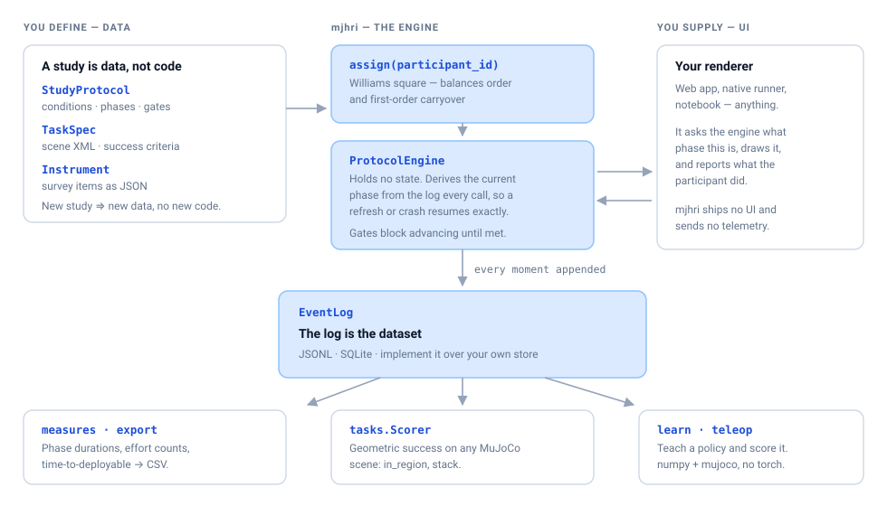
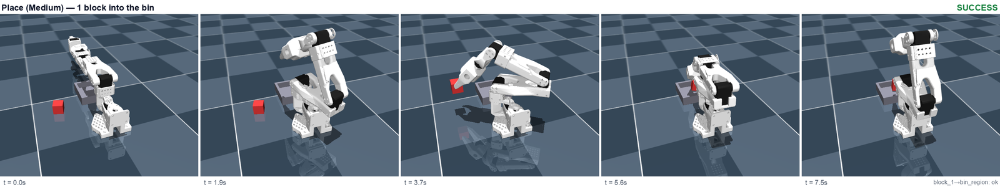
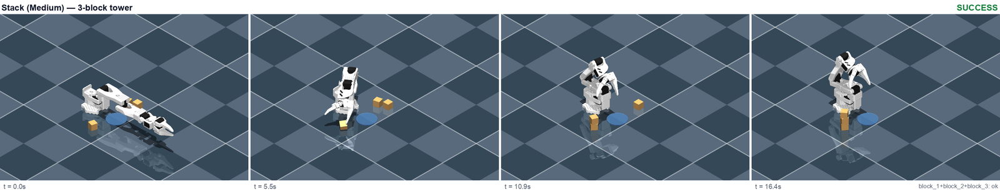
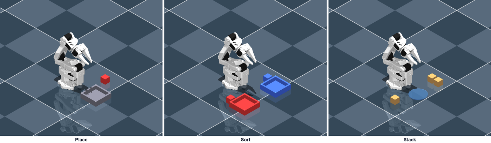

# mujoco-hri-study (`mjhri`)

**An experiment engine for human–robot interaction studies in MuJoCo.**
jsPsych/PsychoPy, but for studies where the participant teaches a robot.

[](https://github.com/kite-ml/mujoco-hri-study/actions/workflows/ci.yml)
[](pyproject.toml)
[](LICENSE)

A study is **data** — conditions, phase sequences, counterbalancing, survey
instruments, tasks, success criteria. `mjhri` runs the protocol and records the
event log. You supply the interface. Nothing is sent anywhere.

<picture>
  <source media="(prefers-color-scheme: dark)" srcset="docs/media/architecture-dark.svg">
  
</picture>

---

## Install

Not on PyPI yet — install from the repo:

```bash
pip install "git+https://github.com/kite-ml/mujoco-hri-study.git"
```

Or from a clone, with the test extras:

```bash
git clone https://github.com/kite-ml/mujoco-hri-study && cd mujoco-hri-study
pip install -e ".[dev]"
```

Python 3.10+. The core needs only `pydantic`; `mujoco` and `numpy` are pulled in for
scoring, teleop and the learning stack.

## 60 seconds

```python
from mjhri import (Condition, InMemoryEventLog, PhaseSpec, ProtocolEngine,
                   StudyProtocol, assign)

protocol = StudyProtocol(
    id="teaching-trust", name="Does how you teach a robot change whether you trust it?",
    conditions=[
        Condition(id="A", label="Direct teleoperation",  modality="teleop"),
        Condition(id="B", label="Reward specification",  modality="reward_spec"),
        Condition(id="C", label="Language description",  modality="description"),
    ],
    phases=[
        PhaseSpec(name="teach",  kind="teach",  requires_events=["spec_marked_deployable"]),
        PhaseSpec(name="review", kind="survey", requires_instruments=["trust_scale"]),
    ],
    tasks=["place", "sort", "stack"],
)

plan = assign("P7", protocol)          # deterministic — same id, same plan, forever
print(plan.condition_order)            # ['B', 'A', 'C']  (Williams square)

log = InMemoryEventLog()
engine = ProtocolEngine(protocol, plan)
log.emit_many(engine.start(log.query("P7")))

engine.can_advance(log.query("P7"))
# (False, ["requires event 'spec_marked_deployable'"])
```

The gate refuses to advance until the phase's requirements appear in the log. Your
UI decides *how* a participant satisfies it; the engine decides *whether* they have.

Then run the whole thing, including a robot policy scored in MuJoCo:

```bash
python examples/teaching-trust-study/fetch_assets.py   # one-time: the arm meshes
python examples/quickstart.py
```

## See it run

These are real rollouts, rendered headlessly on a laptop CPU. The verdict in the
corner is the task's own `Scorer` reading the final physics state — not a caption.





Regenerate both with [`docs/make_media.py`](docs/make_media.py). If a rollout fails,
the figure says FAILURE — the images cannot drift from what the code does.

## What it does

### 1. Protocol — a phase machine that survives a refresh

The engine holds **no mutable state**. `state(events)` re-derives the current phase
from the log on every call, so a browser refresh, a crashed process, or a handoff
between two hosts all land in the same place. Phases declare gates — required events
and required instruments — and `advance()` raises rather than skipping one.

`group="deploy"` phases run after *every* condition's main phases, which is the
two-visit flow you need when model training happens asynchronously between sessions.

### 2. Counterbalancing — deterministic, and actually balanced

Condition order comes from a **Williams design**: a Latin square in which each
condition follows every other condition equally often, so first-order carryover is
controlled rather than merely randomised. Task assignment rotates independently, so
task and condition are not confounded.

It is a pure function of the participant id. Nothing to store, nothing to resume.

```python
from mjhri import williams_square
williams_square(4)   # [[0,3,1,2],[1,0,2,3],[2,1,3,0],[3,2,0,1]]
```

### 3. Events — the log *is* the dataset

One standardized event schema, an `EventLog` interface with JSONL and SQLite
backends built in, derived measures as pure functions, and anonymized CSV export
keyed only on participant id.

```python
from mjhri.events.export import write_events_csv, write_summary_csv
write_summary_csv({"P7": log.query("P7")}, "summary.csv")
# participant_id,condition,teach_time_s,time_to_deployable_spec_s,success_rate,deploy,…
```

Point it at your own database by implementing two methods:

```python
class PostgresEventLog(EventLog):
    def emit(self, event): ...
    def query(self, participant_id=None): ...
```

### 4. Instruments — scales as renderer-agnostic JSON, with their provenance

`trust_scale`, `nasa_tlx`, `sus`, `control_steer_effort`, `deploy_confidence`, and
two embedded attention checks ship built in. Load your own with `load_dir()`.

Every instrument states where it came from, so you can cite what you administered:

```python
get_instrument("sus").metadata["citation"]
# "Brooke, J. (1996). SUS: A 'quick and dirty' usability scale. …"
get_instrument("sus").metadata["adaptation"]
# "The referent noun is changed from 'the system' to 'this teaching method' …"
```

Two things that matter for a write-up. `sus` and `trust_scale` are **adapted** —
reworded for a robot-teaching context — so report them as adapted from their source,
not as the original instrument. And `control_steer_effort` and `deploy_confidence`
are **study-defined**, not published scales; their `metadata["instrument"]` says so.
The SUS attribution notice (© Digital Equipment Corporation, 1986) travels with the
instrument because its terms require it.

### 5. Scoring — geometric success on *any* MuJoCo scene

Criteria name bodies and sites by string and resolve against whatever model you hand
them, live or from a restored `qpos` snapshot.

```python
from mjhri.tasks import Scorer
Scorer.from_spec(spec).score(model, data).success   # ground truth, no heuristics
```

### 6. Learn — teach a policy, no GPU, no torch

A dependency-light stack (numpy + mujoco only) covering the three teaching pathways a
study might compare: imitation from demonstrations, reward-specification tuned by
CEM, and language-generated plans. `score_policy` evaluates any of them over
randomized resets using the task's own scorer.

```python
from mjhri.learn import plan_from_taskspec, score_policy
from mjhri.robots import SO_ARM100

SO_ARM100.require(model)                        # fails loudly on a mismatched scene
picks = plan_from_taskspec(model, data, spec)
score_policy(model,
             lambda: SO_ARM100.controller(model).set_plan(picks),
             spec,
             grasp_factory=lambda: SO_ARM100.grasp(model, place_targets=targets),
             n_rollouts=20)
# {'successes': 20, 'n': 20, 'rate': 1.0}
```

### 7. Teleop — keyboard control of any arm

Damped-least-squares end-effector IK with an optional axis-alignment constraint (for
clean top-down grasps), plus LeRobot-format demonstration recording.

## Robot profiles

The learners are robot-agnostic, but they need *measured* numbers: where the grasp
point actually sits between the finger pads, how far the arm can reach, how much
tolerance the gripper has. Those are not guessable — an end-effector offset that is
wrong by a few centimetres does not raise, it silently scores **0%**.

So each arm gets a `RobotProfile`. `SO_ARM100` ships measured against the bundled
scenes. Bring your own:

```python
from mjhri.robots import RobotProfile, register_robot

register_robot(RobotProfile(
    name="my_arm", ee_body="gripper_base",
    arm_joints=("j1", "j2", "j3", "j4", "j5", "j6"),
    gripper_actuator="gripper",
    ee_offset=(0.0, 0.0, -0.08),        # measured to the point between the pads
))
```

`profile.require(model)` turns a silent 0% into a message naming what does not line up.

## The bundled study

`examples/teaching-trust-study/` is a complete three-arm within-subjects design:
three teaching modalities × three tasks × two difficulties, with scenes, task specs,
and success criteria.



| Task | Medium | Hard |
| --- | --- | --- |
| **Place** | 1 block into the bin | 3 blocks into the bin |
| **Sort** | 2 blocks to colour-matched bins | 4 blocks to matching bins |
| **Stack** | 3-block tower | 5-block tower |

The scenes `<include>` the SO-ARM100 from [MuJoCo Menagerie](https://github.com/google-deepmind/mujoco_menagerie),
which is not vendored here. Fetch it once:

```bash
python examples/teaching-trust-study/fetch_assets.py
```

## What it deliberately does not do

- **No compute.** Training and inference are host concerns; the engine records that
  they happened. `mjhri.learn` is for studies that need a policy without a GPU, not a
  replacement for a real training stack.
- **No storage opinions.** Implement `EventLog` for your database. The built-in
  backends are plain local files.
- **No UI.** Phases carry a `kind` and free-form `metadata`; what that looks like on
  screen is entirely yours.
- **No telemetry.** This package never sends data anywhere.

## Testing

```bash
pip install -e ".[dev]"
python examples/teaching-trust-study/fetch_assets.py   # enables the scene-backed tests
pytest -q
```

Without the assets step the scene-backed tests **skip** rather than fail, so a green
run does not mean you exercised them. CI fetches them.

## Documentation

| | |
| --- | --- |
| [`examples/quickstart.py`](examples/quickstart.py) | a whole study in one file |
| [`docs/make_media.py`](docs/make_media.py) | regenerates every figure in this README |
| [`ROADMAP.md`](ROADMAP.md) | where this is going, and what it will not become |
| [`CONTRIBUTING.md`](CONTRIBUTING.md) | setup, house rules, adding a robot profile |
| [`RELEASING.md`](RELEASING.md) | cutting a release to PyPI |
| [`CITATION.cff`](CITATION.cff) | how to cite |

## Citing

If you use this in published research, please cite it — see [`CITATION.cff`](CITATION.cff),
or use GitHub's "Cite this repository" button.

## License

Apache-2.0. Built by [Kite](https://kiteml.com). The SO-ARM100 model fetched by
`fetch_assets.py` is Apache-2.0 from MuJoCo Menagerie, © The Robot Studio and
Google DeepMind.
